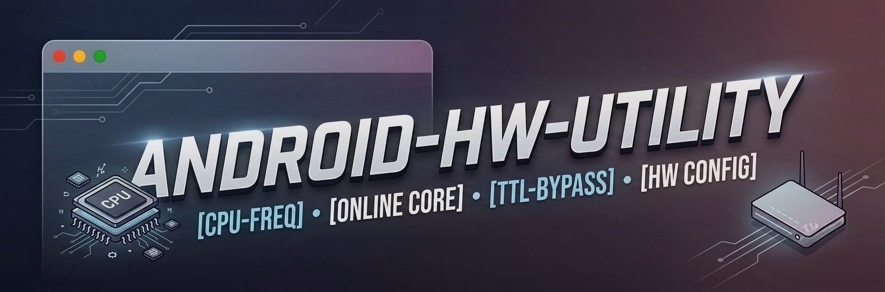

<p align="center">
  
</p>

# 🛠️ Android-HW-Utility

A curated collection of lightweight Shell scripts designed for rooted Android devices. These utilities allow power users and developers to manipulate system properties, bypass carrier restrictions, and control hardware states directly via terminal.

> ⚠️ **Prerequisites:** A rooted Android device (Magisk, KernelSU, or APatch) with Superuser access and a Terminal emulator (e.g., Termux) or ADB shell.

---

## 📜 Available Scripts

### 1. `renableCore` — CPU Core Recovery Utility
* **Description:** Automatically detects all available CPU cores and forces offline/stuck cores back online. On many Android kernels, thermal throttling or aggressive power management (*hotplugging*) forces cores into an offline state and fails to wake them up. This script safely queries system CPU topology and wakes up dormant cores to restore maximum device performance.
* **Key Features:**
 * Dynamic CPU core count detection to prevent out-of-bounds errors.
 * Preserves master core state (`cpu0`).
 * Post-execution verification to check if cores successfully came online.

#### Usage
```bash
su
chmod +x renableCore
./renableCore
```

---

## 2. `changeTTL` — Tethering TTL Bypasser (IPv4 & IPv6)
* **Description:** Modifies the system's default Time To Live (TTL) and Hop Limit value based on user input across all active network interfaces (`wlan0`, `rmnet_data*`, `rndis0`, etc.). Setting the TTL value via user prompt ensures that data packets passing through tethered devices (like PC or Smart TV via Mobile Hotspot or USB Tethering) arrive at the carrier gateway with a custom TTL (e.g., 65), appearing as native mobile traffic.
* **Key Features:**
  * Takes dynamic user input with built-in numerical validation (1–255).
  * Configures both IPv4 (`ip4tables` / `sysctl`) and IPv6 (`ip6tables`) rules.
  * Solves hotspot throttling and carrier tethering data caps.
 
#### Usage
```bash
su
chmod +x changeTTL
./changeTTL 65
```

---

## 3. `lockCPUFreq` — Custom CPU Frequency Lock Utility
* **Description:** Sets all detected CPU cores to a specific user-defined frequency (such as 1800000 kHz / 1.8 GHz). Before applying changes, the script inspects each core's hardware limits (`cpuinfo_min_freq` and `cpuinfo_max_freq`) to clamp the frequency safely within valid ranges, preventing out-of-bounds errors or unstable behavior.
* **Key Features:**
  * Auto-detects total CPU cores and individual core hardware limits.
  * Clamps target frequencies automatically if they exceed minimum or maximum limits.
  * Locks both `scaling_min_freq` and `scaling_max_freq` across all CPU clusters without modifying the scaling governor.
 
#### Usage
```bash
su
chmod +x lockCPUFreq
./lockCPUFreq 1800000
```

---

## 4. `lockMaxCPUFreq` — Maximum CPU Frequency Auto-Lock Utility
* **Description:** Automatically queries each CPU core's highest supported hardware frequency (`cpuinfo_max_freq`) and forces the CPU to lock at its maximum clock speed without requiring any user input. It handles asymmetric CPU topologies (such as BIG.little architectures) by independently setting each cluster to its respective maximum threshold.
* **Key Features:**
  * Fully automated execution with zero manual user input required.
  * Reads per-core maximum limits directly from kernel driver files.
  * Preserves original CPU governors (e.g., `schedutil`) while locking minimum and maximum scaling clocks to peak performance.

#### Usage
```bash
su
chmod +x lockMaxCPUFreq
./lockMaxCPUFreq
```

---

## 5. `setGovernor` — Interactive CPU Governor Menu Selector
* **Description:** Scans active CPU cores and dynamically generates a numbered menu of all available scaling governors supported by the running kernel (e.g., `performance`, `schedutil`, `powersave`). Pauses for user input via terminal prompt before applying the chosen governor across all detected CPU cores.
* **Key Features:**
  * Auto-detects supported governors directly from `/sys/devices/system/cpu/cpufreq/scaling_available_governors`.
  * POSIX/`mksh`-compliant interactive menu designed specifically for Android shell environments (Termux/ADB).
  * Includes robust input validation to prevent invalid menu selections.
  * Performs per-core verification post-execution to ensure successful governor assignment.

#### Usage
```bash
su
chmod +x setGovernor
./setGovernor
```

---

## 🚀 Quick Installation

You can clone this repository directly on your device using Termux or git-enabled terminal:

```bash
git clone https://github.com/your-username/Android-HW-Utility.git
cd Android-HW-Utility
su
```

---

## ⚠️ Disclaimer

These scripts modify low-level hardware and networking properties of your Android system.
* Forcing CPU cores online under high temperatures may increase device heat and battery drain.
* Ensure you understand what each command does before executing.
* The maintainers are not responsible for bricked devices, thermal damage, or carrier policy violations.

---

## 🤝 Contributing

Pull requests, improvements, and new hardware/software utility scripts are always welcome! Feel free to open an issue or submit a PR to help expand the toolkit.
